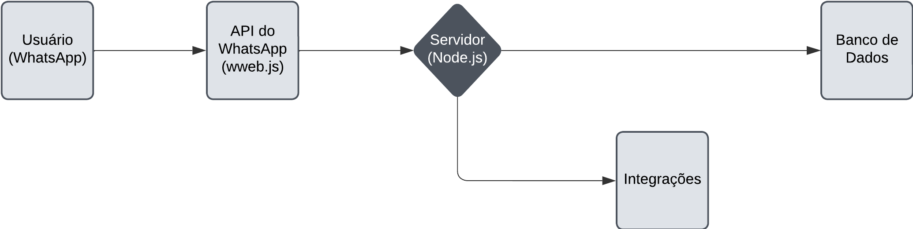

# ChatBot para Whatsapp
### desenvolvimento de um Chatbot para WhatsApp feito pela Link Jr.O objetivo deste projeto é criar uma solução automatizada para atendimento ao cliente no WhatsApp, utilizando Node.js como principal ferramenta de desenvolvimento. O chatbot será capaz de interagir com os clientes e oferecer redirecionamento para atendimento humano caso necessário.

## Fluxograma da Arquitetura

### Componentes:
1. **Usuário (WhatsApp):**
   - Envia mensagens pelo aplicativo WhatsApp. 
2. **API do WhatsApp (wweb.js):**
   - Interage com o cliente do WhatsApp Web, capturando e enviando mensagens.
3. **Servidor (Node.js):**
   - Processa mensagens recebidas e aplica a lógica de negócio para fornecer respostas.
4. **Banco de Dados:**
   - Armazena informações do usuário e histórico de interações (opcional).
5. **Integrações:**
   - Conexões com APIs externas para fornecer dados adicionais ou funcionalidades.

# Instrução de instalação 
com o mode instalado na sua máquina, execute o comando abaixo para instalar as dependências necessárias para o projeto:

    npm install
## pré requisitos
Node .js instalado na máquina V20 ou superior
## Funções do código
- Atendimento Automático  
- Redirecionamento para Atendimento Humano  
- Suporte a Múltiplos Idiomas  
```bash
const qrcode = require('qrcode-terminal');
const { Client, LocalAuth } = require('whatsapp-web.js');
const client = new Client({ authStrategy: new LocalAuth() });
```
Três principais funções do código:    
- O código utiliza o módulo 'qrcode-terminal' para gerar e exibir códigos QR no terminal
- O código utiliza o módulo 'whatsapp-web.js' para criar uma instância do cliente, 
- Criado uma nova instância do Client e passado um objeto de configuração que especifica a estratégia de autenticação a ser usada.
## Estrutura do Projeto 
    /src
      /controllers      # Controladores para gerenciar a lógica do chatbot
      /models           # Modelos de dados, se necessário
      /services         # Serviços auxiliares, como integração com APIs
      index.js          # Ponto de entrada da aplicação
## Exemplo de uso 
Exemplos de Interação :  
Exemplo 1 - Pergunta Frequente:  
Usuário: "Qual o horário de funcionamento de vocês?"
Chatbot: "Nosso horário de funcionamento é de segunda a sexta-feira, das 9h às 18h. Como posso ajudar mais?" 
  
Exemplo 2 - Atendimento Humano:  
Usuário: "Preciso de ajuda com algo mais específico."
Chatbot: "Claro! Vou transferir você para um dos nossos atendentes. Um momento, por favor."
# LICENSE 
Esse projeto é licenciado sob a licença [MIT](/LICENSE).

